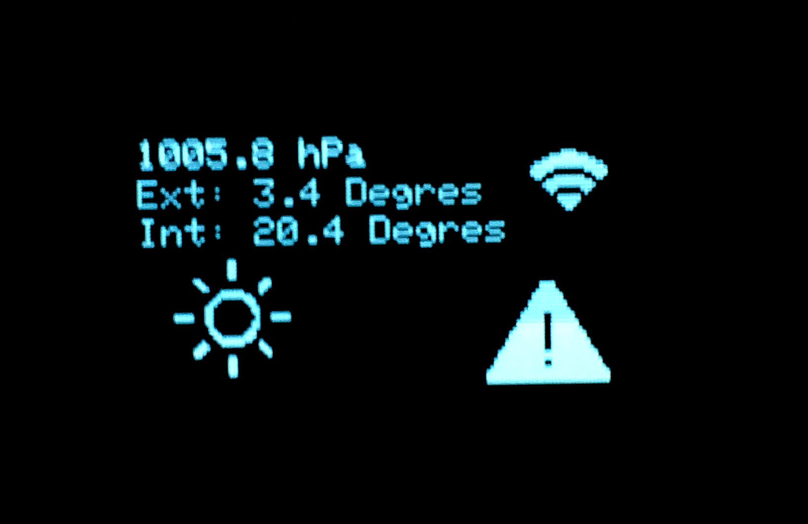

# Weather-Station-with-ESP8266-and-Home-assistant
Weather Station with ESP8266-12E and Oled Display SSD1306 

**Framework used: Arduino**

**IDE used**:
[PlatformIO Core](http://platformio.org/get-started/cli)

**MQTT publisher: Home Assistant Hass**
[HomeAssistant](https://home-assistant.io/)

HomeAssistant publishes data through MQTT on topic "sensor/#"

Here my configuration.yaml for the MQTT part:

```bash
- alias: 'mqttpublisher'
  trigger:
   platform: time
   # You can also match on interval. This will match every 5 minutes     
   minutes: '/4'
   seconds: '00'
  action:
   - service: mqtt.publish
     data:
       topic: "sensor/lux"
       payload_template: "{{ states('sensor.ext_sensor_light_intensity') }}"
   - service: mqtt.publish
     data:
      topic: "sensor/danger"
      payload_template: "{{ states('sensor.pws_alerts') }}"
   - service: mqtt.publish
     data:
       topic: "sensor/icone"
       payload_template: "{{ states('sensor.weather_symbol') }}"
   - service: mqtt.publish
     data:
       topic: "sensor/temp"
       payload_template: "{{ states('sensor.ext_sensor_temperature') }}"
   - service: mqtt.publish
     data:
       topic: "sensor/temp_int"
       payload_template: "{{ states('sensor.interieur_temperature') }}"


- alias: 'AutoON_Light PIR'
  condition:
    condition: and
    conditions:
     - condition: numeric_state
       entity_id: sensor.ext_sensor_light_intensity
       below: 400
     - condition: time
       after: '07:00:00'
       before: '23:00:00'
  trigger:
   platform: mqtt
   topic: ESP/all_switches
   payload: 'ON'
  action:
   service: switch.turn_on
   entity_id: switch.tv, switch.canape

- alias: 'AUTOFF_all'
  trigger:
   platform: mqtt
   topic: ESP/all_switches
   payload: 'OFF'
  action:
   service: switch.turn_off
   entity_id: switch.tv, switch.canape, switch.salon, switch.guirlande


```

Weather symbols are provided by [yr](http://om.yr.no/symbol/)

More informations regarding implementation with Hass [here](https://home-assistant.io/components/sensor.yr/)

Danger symbol is provided by [wundergroud](https://www.wunderground.com/EU/FR/064.html)

More informations regarding implementation with Hass [here](https://home-assistant.io/components/sensor.wunderground/) 



